# Cours IFAL Sécurité informatique
## Thierry Boulanger
## 12 avri 2026

## Introduction
La sécurité informatique est l'ensemble des mesures techniques et organisationnelles visant à protéger les données et les systèmes contre les accès non autorisés, les vols ou les dégradations. Elle repose sur trois piliers fondamentaux : garantir la confidentialité, l'intégrité et la disponibilité de l'information dans un monde de plus en plus connecté.

### Objectif Opérationnel
Le but principal est de **développer des applications sécurisées**. Cela implique d'intégrer la sécurité non pas comme une option finale, mais comme une composante essentielle de tout le cycle de vie du logiciel (approche *Security by Design*).

### Identifier les Risques et Menaces
Le premier palier de l'apprentissage consiste à savoir **identifier les risques et les menaces** inhérentes à la conception ou à l'utilisation d’une application. Il s'agit de comprendre comment un attaquant pourrait exploiter une faille, qu'elle provienne d'une erreur de logique dans le code ou d'une mauvaise manipulation de l'utilisateur final.

### Protection et Mesures Correctives
Une fois les dangers ciblés, l'étape suivante est d'**appliquer les mesures nécessaires** à la protection contre ces risques. Cela passe par la mise en place de contre-mesures techniques, comme le chiffrement, la validation rigoureuse des entrées ou la gestion stricte des droits d'accès, afin de neutraliser les menaces identifiées.

### Culture des Bonnes Pratiques
Enfin, la sécurité repose sur l'adoption de réflexes quotidiens : **appliquer les bonnes pratiques de développement**. Cela inclut la rédaction d'un code propre et documenté, la mise à jour régulière des dépendances et l'utilisation de standards reconnus pour garantir une robustesse logicielle sur le long terme.

## I. Introduction à la sécurité des applications

La sécurisation des applications est l'ensemble des mesures et pratiques visant à protéger le code, les données et les fonctionnalités d'un logiciel contre les cyberattaques, les accès non autorisés et les vulnérabilités tout au long de son cycle de vie.

Concrètement, cela signifie qu'on ne pense pas à la sécurité uniquement à la fin du projet, juste avant la mise en production — c'est déjà trop tard. On l'intègre dès la conception, à chaque étape : quand on écrit le code, quand on le teste, quand on le déploie, et même quand on le retire. Un logiciel non maintenu est une porte d'entrée pour les attaquants.

---

### 1.1 Concepts fondamentaux

#### Importance de la sécurité dans le cycle de vie de développement — SDLC

**SDLC** (*Software Development Life Cycle*, cycle de vie du développement logiciel) désigne l'ensemble des phases par lesquelles passe un logiciel, de sa conception à sa mise hors service. Ces phases sont typiquement : planification, conception, développement, test, déploiement, et maintenance.

Sans intégration de la sécurité, on développe vite mais on crée des vulnérabilités que l'on découvre trop tard — au moment où elles sont exploitées. Corriger une faille en production coûte en moyenne **30 fois plus cher** que de l'éviter pendant la phase de conception. C'est la raison d'être du modèle **Secure SDLC** : la sécurité n'est pas une phase séparée, c'est une dimension présente à chaque étape.

En pratique, cela se traduit par des actions concrètes à chaque phase : modélisation des menaces pendant la conception, revues de code sécurisé pendant le développement, tests d'intrusion avant le déploiement, et surveillance continue en production.

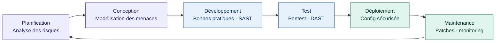

---

#### Typologie des applications et enjeux spécifiques

Toutes les applications ne se ressemblent pas et n'exposent pas les mêmes surfaces d'attaque. Comprendre sur quel type d'application vous travaillez, c'est comprendre où chercher les vulnérabilités en priorité.

**Applications web** — accessibles via un navigateur, elles sont les plus exposées car leur interface est publique par définition. Les menaces principales sont les injections (SQL, commandes), le **XSS** (*Cross-Site Scripting*), le **CSRF** (*Cross-Site Request Forgery*), et les problèmes d'authentification. Ce sont également les plus faciles à tester : un navigateur et Burp Suite suffisent pour commencer.

**Applications mobiles** — elles tournent sur des appareils que vous ne contrôlez pas. Les risques spécifiques sont le stockage de données sensibles sur l'appareil (clés API codées en dur dans l'APK, tokens dans des fichiers lisibles), les communications non chiffrées, et la décompilation du code. Un attaquant peut télécharger votre application sur le store, la décompiler et lire votre code source si vous n'avez pas pris de précautions.

**Applications desktop** — installées sur un poste de travail, elles ont souvent accès à des ressources système (fichiers, réseau local, périphériques). Les risques incluent les élévations de privilèges, les DLL hijacking (remplacement de bibliothèques système), et les mises à jour non sécurisées.

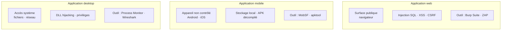

---

### 1.2 Panorama des menaces et vulnérabilités

#### Vulnérabilités communes — OWASP Top 10

**OWASP** (*Open Web Application Security Project*, projet ouvert de sécurité des applications web) est une fondation internationale à but non lucratif qui publie des ressources gratuites sur la sécurité applicative. Son document le plus connu est l'**OWASP Top 10** : la liste des dix catégories de vulnérabilités les plus critiques et les plus fréquentes dans les applications web. C'est la référence absolue pour tout développeur qui commence à s'intéresser à la sécurité.

Voici les principales catégories avec leur explication concrète :

**Injection (A03)** — vous envoyez du code malveillant là où l'application attend une donnée. L'exemple classique : dans un champ de connexion, au lieu de taper un mot de passe, vous tapez `' OR '1'='1`. Si la requête SQL est construite par concaténation de chaînes, elle devient `SELECT * FROM users WHERE password='' OR '1'='1'` — et vous êtes connecté sans connaître le mot de passe. La parade : toujours utiliser des requêtes préparées (*prepared statements*).

**XSS — Cross-Site Scripting (A03)** — vous injectez du JavaScript malveillant dans une page qui sera exécutée dans le navigateur d'un autre utilisateur. Exemple : un champ de commentaire qui affiche le texte sans l'échapper. Vous postez `` et tous les visiteurs qui voient ce commentaire voient leur session volée. La parade : échapper toutes les sorties HTML.

**CSRF — Cross-Site Request Forgery (A01)** — vous forcez le navigateur d'un utilisateur authentifié à effectuer une action à son insu. Exemple : vous lui envoyez un email avec une image dont l'URL est en réalité `https://sa-banque.com/virement?montant=1000&vers=votre-compte`. Si la banque n'a pas de protection CSRF, le virement s'effectue au chargement de l'email. La parade : les tokens CSRF (valeurs secrètes uniques par formulaire).

**Mauvaise configuration de sécurité (A05)** — laisser des valeurs par défaut en production : mot de passe admin `admin/admin`, pages d'erreur qui affichent la stack trace complète, serveurs avec des ports inutiles ouverts, fichiers de configuration accessibles publiquement.

**Composants vulnérables (A06)** — utiliser des bibliothèques ou frameworks avec des vulnérabilités connues. C'est l'une des causes les plus fréquentes de brèches : votre code est parfait, mais une dépendance que vous n'avez pas mise à jour depuis six mois contient une faille critique.

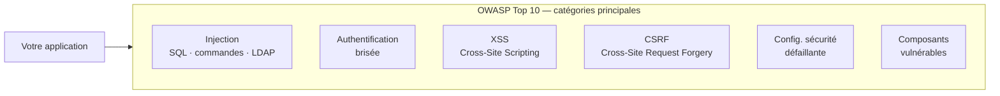

---

#### Attaques ciblées : phishing, force brute et DDoS

Au-delà des vulnérabilités dans le code, les attaquants utilisent aussi des techniques qui ciblent les humains ou saturent les systèmes.

**Phishing** — l'attaque la plus répandue et souvent la plus efficace. Le principe : envoyer un email, un SMS ou un message qui semble provenir d'une source de confiance (votre banque, votre employeur, GitHub, AWS) pour vous pousser à cliquer sur un lien vers une fausse page de connexion, ou à télécharger un fichier malveillant. En 2023, plus de 90 % des cyberattaques commencent par un email de phishing. Ce n'est pas une faille dans votre code — c'est une faille humaine. La parade : authentification à deux facteurs (**2FA** — *Two-Factor Authentication*), formation des équipes, et méfiance systématique envers les demandes urgentes.

**Attaque par force brute** — essayer toutes les combinaisons possibles de mots de passe jusqu'à trouver la bonne. Une attaque par force brute basique sur un mot de passe de 6 chiffres prend quelques secondes. Sur un mot de passe complexe de 12 caractères, des années. Les parades : limiter le nombre de tentatives (*rate limiting*), imposer des mots de passe forts, utiliser le 2FA, et détecter les tentatives anormales via votre SIEM.

**DDoS — Distributed Denial of Service** (*déni de service distribué*) — saturer un serveur avec tellement de requêtes simultanées qu'il ne peut plus répondre aux utilisateurs légitimes. L'attaque vient de milliers de machines compromises (un *botnet*) ce qui la rend difficile à bloquer par une simple liste noire d'IP. La parade : des services de mitigation DDoS (Cloudflare, AWS Shield), une architecture qui peut scaler rapidement, et des règles de rate limiting.

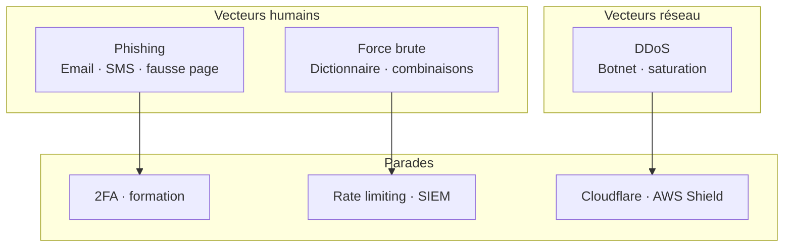

---

#### Études de cas concrets

Voici trois incidents réels qui illustrent les vulnérabilités décrites ci-dessus. Les étudier aide à comprendre pourquoi ces mesures ne sont pas théoriques.

**Equifax (2017)** — 147 millions de personnes exposées. Cause : une vulnérabilité connue dans Apache Struts (CVE-2017-5638) non patchée depuis deux mois malgré une alerte publique. Un attaquant l'a exploitée pour accéder aux systèmes internes et exfiltrer des données pendant 78 jours sans être détecté. Leçon : gestion des correctifs et surveillance SIEM.

**Twitter (2020)** — comptes de Barack Obama, Elon Musk, Apple et d'autres piratés pour diffuser une arnaque au Bitcoin. Cause : attaque de phishing ciblé (*spear phishing*) sur des employés de Twitter pour obtenir leurs credentials d'accès aux outils internes. Leçon : 2FA, principe du moindre privilège (RBAC), et sensibilisation des équipes.

**Log4Shell (2021)** — considérée comme l'une des vulnérabilités les plus critiques de l'histoire (score CVSS : 10/10). Cause : une faille dans Log4j, une bibliothèque Java de journalisation utilisée dans des millions d'applications. Une simple ligne dans un champ texte suffisait à exécuter du code à distance sur le serveur. Leçon : surveiller ses dépendances et s'abonner aux alertes CVE.

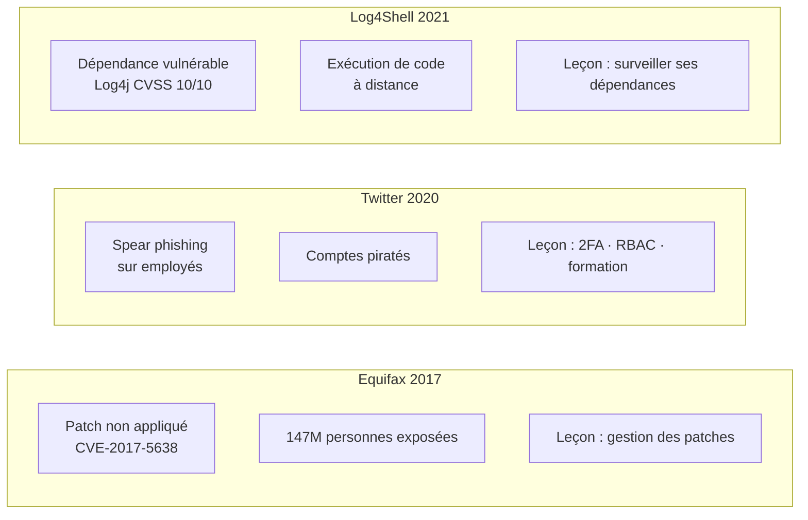

> Ces trois incidents auraient pu être évités avec des pratiques décrites dans ce guide : gestion des correctifs, sensibilisation au phishing, surveillance des dépendances.

## II. Mesures de sécurité essentielles

### 2.1 Développement sécurisé

#### Bonnes pratiques : validation des entrées, gestion des erreurs et chiffrement

Quand vous développez une application, vous recevez constamment des données venant de l'extérieur : formulaires remplis par des utilisateurs, paramètres dans une URL, données envoyées par d'autres services. Le problème, c'est que ces données peuvent être malveillantes. La **validation des entrées** consiste à vérifier que ce que vous recevez correspond bien à ce que vous attendiez, avant de l'utiliser. Par exemple, si vous attendez un âge (un nombre entier entre 0 et 120), vous vérifiez exactement ça — et vous rejetez tout le reste.

La **gestion des erreurs** c'est l'art de ne pas laisser l'application planter ou, pire, révéler des informations sensibles quand quelque chose tourne mal. Un message d'erreur qui dit `SQL syntax error near 'DROP TABLE'` dit à un attaquant exactement quelle technologie vous utilisez et comment il peut l'exploiter. Il faut donc capturer les erreurs, les logger côté serveur, et renvoyer un message générique à l'utilisateur.

Le **chiffrement** transforme des données lisibles en données illisibles sans la clé. On l'utilise pour les mots de passe (on ne stocke jamais un mot de passe en clair, on en stocke un hash avec `bcrypt` ou `argon2`), pour les communications réseau (HTTPS), et pour les données sensibles au repos.

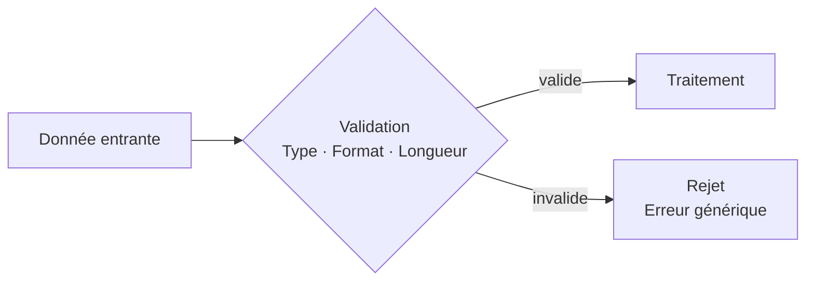

---

#### Gestion des identités et des accès — IAM

**IAM** (*Identity and Access Management*) répond à deux questions fondamentales :

**L'authentification** — "Qui êtes-vous ?" — vérifie l'identité.
- **OAuth** (*Open Authorization*) : connexion via un tiers (Google, GitHub…) sans partager votre mot de passe.
- **SSO** (*Single Sign-On*, connexion unique) : une seule connexion donne accès à plusieurs applications du même écosystème.

**L'autorisation** — "Qu'avez-vous le droit de faire ?" — contrôle les permissions.
- **RBAC** (*Role-Based Access Control*, contrôle d'accès par rôle) : on assigne des rôles (admin, éditeur, lecteur) et chaque rôle a des permissions prédéfinies.

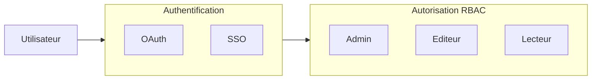

---

### 2.2 Protection des données sensibles

#### Cryptographie : AES, RSA et gestion des clés

La cryptographie transforme un *texte clair* en *texte chiffré* illisible sans la clé.

**AES** (*Advanced Encryption Standard*) — clé **symétrique** : la même clé chiffre et déchiffre. Rapide, idéal pour les gros volumes (fichiers, bases de données).

**RSA** (*Rivest–Shamir–Adleman*) — clé **asymétrique** : une clé publique chiffre, seule la clé privée déchiffre. Plus lent mais indispensable pour l'échange sécurisé de clés (ex. : début d'une connexion HTTPS).

La **gestion des clés** est souvent le maillon faible : stocker la clé dans le même fichier que les données chiffrées revient à laisser la clé sous le paillasson. Utilisez des gestionnaires dédiés (HashiCorp Vault, AWS KMS).

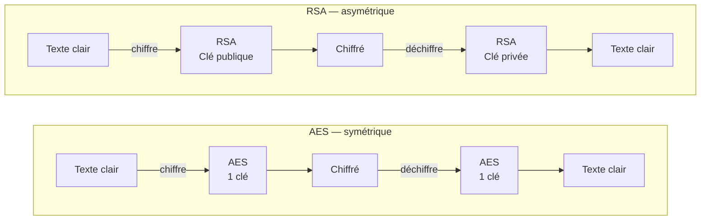

---

#### Stockage sécurisé : bases de données, fichiers et cookies

**Bases de données** : ne jamais stocker les mots de passe en clair. Stockez leur *hash* avec `bcrypt` ou `argon2` (algorithmes volontairement lents pour freiner les attaques par dictionnaire). Chiffrez les colonnes sensibles (numéros de carte, données médicales) avec AES.

**Fichiers** : placez les fichiers sensibles hors de la racine web. Servez-les uniquement via du code qui vérifie les droits de l'utilisateur avant chaque accès.

**Cookies** : utilisez systématiquement ces trois attributs :
- `HttpOnly` — inaccessible en JavaScript (bloque le vol via XSS)
- `Secure` — envoyé uniquement sur HTTPS
- `SameSite` — bloque l'envoi vers des sites tiers (limite les attaques CSRF)

---

### 2.3 Évaluation et tests de sécurité

#### Audit de code : SAST et DAST

**SAST** (*Static Application Security Testing*, test de sécurité statique) analyse le code source **sans l'exécuter**. Il détecte les patterns dangereux connus : requêtes SQL par concaténation, secrets codés en dur, entrées non validées. Outil de référence : **SonarQube**.

**DAST** (*Dynamic Application Security Testing*, test de sécurité dynamique) teste l'application **pendant qu'elle tourne**, en lui envoyant de vraies requêtes malveillantes. Outil de référence : **OWASP ZAP** (*Zed Attack Proxy*).

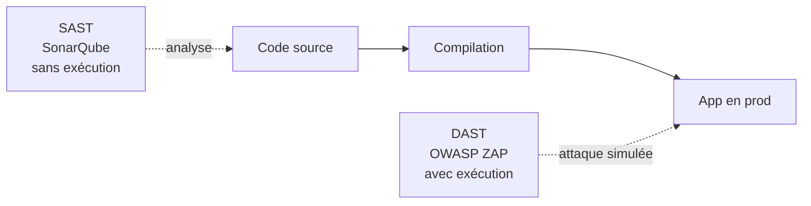

---

#### Tests d'intrusion — Pentests

Un **pentest** (*penetration test*, test d'intrusion) est une simulation d'attaque **autorisée** sur un système, encadrée par un contrat définissant précisément le périmètre.

**Conseil de démarrage** :
- [TryHackMe](https://tryhackme.com) — très guidé, parfait pour débuter
- [Hack The Box](https://hackthebox.com) — plus difficile, plus proche du réel
- **DVWA** (*Damn Vulnerable Web Application*) — à installer en local pour s'entraîner
- **Burp Suite** — intercepte et modifie le trafic HTTP (version communautaire gratuite)

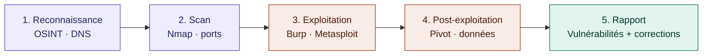

> ⚠️ Toujours dans un cadre légal — une autorisation écrite est obligatoire avant tout test.

---

## III. Gestion des risques et conformité

### 3.1 Surveillance et gestion des incidents

#### Journaux d'événements et SIEM

Un **log** (journal d'événements) est une trace écrite de ce qui s'est passé dans un système : connexions, accès, erreurs, modifications. Indispensable pour reconstituer un incident après coup et détecter les comportements suspects en temps réel.

**SIEM** (*Security Information and Event Management*, gestion des informations et événements de sécurité) : collecte les logs de toutes les sources, les normalise, les corrèle, et déclenche des alertes. Exemple : 500 tentatives de connexion échouées en 30 secondes depuis une même IP → attaque par force brute détectée.

Outils : **Splunk** (commercial), **ELK Stack** (Elasticsearch + Logstash + Kibana, open-source), **Wazuh** (open-source, excellent pour débuter).

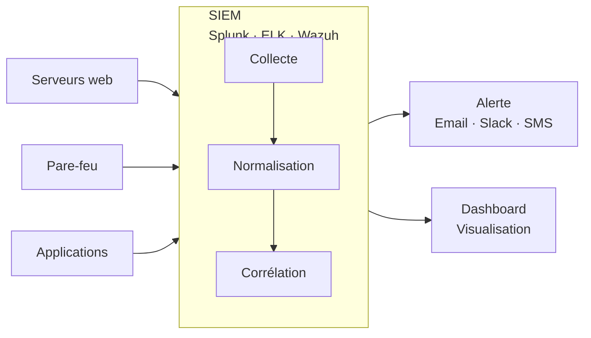

---

#### Réponse aux incidents

Un **IR plan** (*Incident Response Plan*) est un plan défini à l'avance, testé régulièrement, que toute l'équipe connaît.

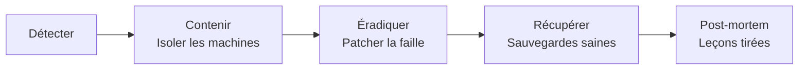

Ne pas oublier la **communication** : qui prévient qui, dans quel délai (72h pour le RGPD), avec quel message. Préparez vos modèles à l'avance.

---

### 3.2 Cadre réglementaire et maintenance

#### RGPD, HIPAA, PCI-DSS

**RGPD** (*Règlement Général sur la Protection des Données*) — loi européenne sur les données personnelles des citoyens de l'UE. Consentement explicite obligatoire, droit à l'effacement, notification en cas de fuite sous 72h. Amende jusqu'à 4 % du CA mondial.

**HIPAA** (*Health Insurance Portability and Accountability Act*) — loi américaine protégeant les données médicales (*PHI — Protected Health Information*). S'applique à tout acteur traitant des données de santé de patients américains.

**PCI-DSS** (*Payment Card Industry Data Security Standard*) — standard imposé par les réseaux de cartes bancaires (Visa, Mastercard…). 12 exigences précises : chiffrement, contrôle d'accès, tests réguliers, journalisation. Sans conformité, vous ne pouvez pas accepter de paiements par carte.

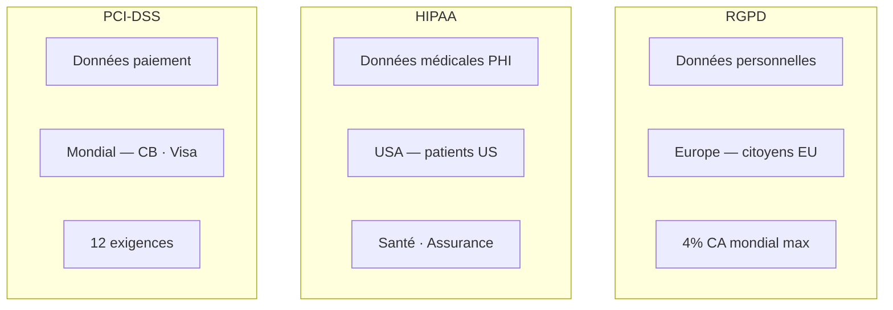

---

#### Gestion des correctifs

La majorité des attaques exploitent des vulnérabilités connues pour lesquelles un patch existe déjà. La fuite Equifax (2017, 147 millions de personnes) exploitait une faille Apache Struts dont le patch existait depuis 2 mois.

Cycle de gestion des correctifs :

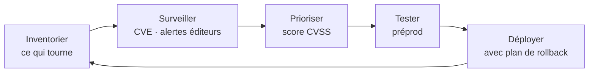

- **CVE** (*Common Vulnerabilities and Exposures*) : référentiel mondial des failles connues
- **CVSS** (*Common Vulnerability Scoring System*) : score de criticité de 0 à 10

---

### 3.3 Culture de sécurité

#### Sensibilisation des équipes

Les humains sont souvent le maillon le plus vulnérable. La sensibilisation comprend :

- Reconnaître les emails de **phishing** (faux expéditeurs, urgence artificielle, liens suspects)
- Ne jamais stocker de secrets (mots de passe, clés API, tokens) dans le code source
- Connaître l'**OWASP Top 10** — les dix catégories de failles les plus fréquentes en développement web

La sensibilisation doit être régulière et pratique : formations courtes, exercices de phishing simulé, revues de code orientées sécurité.

---

#### DevSecOps

**DevSecOps** (*Development + Security + Operations*) intègre la sécurité à chaque étape du cycle de développement, au lieu de la traiter comme une vérification finale.

**CI/CD** (*Continuous Integration / Continuous Deployment*) : système qui compile, teste et déploie automatiquement le code. Dans un pipeline DevSecOps, la sécurité y est intégrée dès le commit.

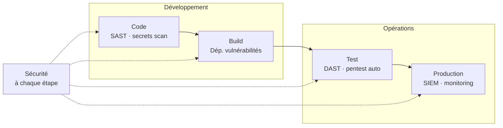

---

## IV. Application pratique

### Mise en œuvre sur un projet collaboratif

Dès le début du projet, mettez en place :

- **SonarQube** sur votre dépôt GitHub — analyse SAST à chaque push
- **Variables d'environnement** pour les secrets — jamais dans le code source, `.gitignore` à jour
- **Authentification JWT** (*JSON Web Token*) ou OAuth — pas de système artisanal
- **SECURITY.md** — documentez vos choix de sécurité

La revue de code est l'occasion d'apprendre collectivement : cherchez spécifiquement les entrées non validées, les requêtes SQL construites par concaténation, les erreurs qui fuient des informations.

---

### Audit et sécurisation en conditions réelles

Changez de perspective : au lieu de construire l'application, cherchez à la casser.

1. Lancez une analyse SAST complète — lisez et comprenez chaque vulnérabilité
2. Installez Burp Suite ou OWASP ZAP en proxy — interceptez les requêtes et modifiez-les manuellement
3. Entraînez-vous sur DVWA ou WebGoat pour pratiquer les injections SQL, XSS, CSRF

**Parcours recommandé pour débuter :**

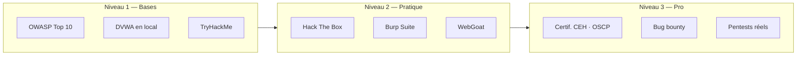

> Travaillez toujours sur des environnements qui vous appartiennent ou pour lesquels vous avez une **autorisation explicite et écrite**.
