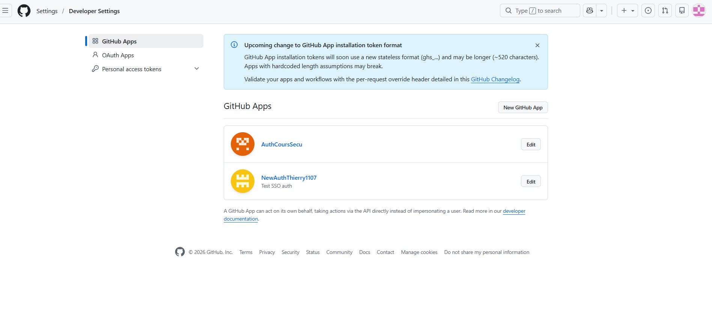

## Oauth avec GitHub

### Mise en place de l'authentification via Oauth avec GitHub

Sur GitHub se rendre dans la partie utilisateur/setting/devloper setting et ajouter un nouveau client id et secret




### Coté front end
Créer un lien se connecter comme ceci :
```html

<a href="/auth/github">Se connecter avec GitHub</a>

```


### Coté back end
### Mise en place de l'authentification via Oauth avec GitHub
Utilisation de la librairie passsport-github.

Cette librairie permet de gérer l'authentification via Oauth avec GitHub.

Pour l'autorisation prévoir une autre librairie comme :
#### A. Casl (@casl/ability) 
CASL est aujourd'hui la référence. Elle va au-delà du simple RBAC en permettant l'ABAC (Attribute-Based Access Control), ce qui signifie que vous pouvez définir des règles basées sur les propriétés des objets (ex: "Un utilisateur peut modifier un article si il en est l'auteur").

Avantages : Isomorphe (partagé entre Frontend et Backend), syntaxe très naturelle (can('update', 'Article')), supporte les conditions complexes.

Idéal pour : Les applications de taille moyenne à grande avec des règles métier évolutives.

#### B. AccessControl 
Si vous n'avez pas besoin de vérifier les attributs des objets mais uniquement des rôles stricts (ex: admin, user, manager) avec des notions d'héritage, AccessControl est parfaite.

Avantages : Chaînage de méthodes très lisible, gestion native de l'héritage des rôles (l'admin hérite des droits du manager).

Exemple : ac.grant('admin').extend('user').updateAny('video').


Voici des exemples concrets de **bonne syntaxe RBAC** selon l'outil ou le framework que vous utilisez. Une bonne syntaxe RBAC doit être **déclarative**, **lisible** et **découplée** de la logique métier (on ne met pas de gros `if/else` directement au milieu d'une requête SQL, par exemple).

---

## 1. Syntaxe purement déclarative (Frameworks & Middlewares)

C'est l'approche la plus propre pour sécuriser des API. On utilise des décorateurs ou des arguments de middleware pour définir les règles d'accès d'un coup d'œil.

### En Node.js (Express standard)

On utilise un middleware qui accepte les rôles autorisés en paramètres.

```javascript
// ✅ BONNE SYNTAXE : Claire, lisible au niveau de la route
router.delete('/users/:id', 
  authenticateJWT, 
  authorizeRoles('admin', 'super_admin'), // Contrôle d'accès explicite
  UserController.deleteUser
);

```

### En NestJS (TypeScript avec Décorateurs)

NestJS excelle dans ce domaine en séparant totalement les rôles du code de la fonction.

```typescript
@Controller('products')
export class ProductController {

  @Post()
  @Roles(Role.Admin, Role.Manager) // ✅ Décorateur personnalisé
  @UseGuards(JwtAuthGuard, RolesGuard) // Application stricte
  createProduct(@Body() createProductDto: CreateProductDto) {
    return this.productService.create(createProductDto);
  }
}

```

---

## 2. Syntaxe avec une librairie dédiée (AccessControl)

Si vous utilisez la bibliothèque `accesscontrol` en Node.js, la syntaxe est basée sur un chaînage de méthodes très proche du langage naturel (Fluent API).

```javascript
const AccessControl = require('accesscontrol');
const ac = new AccessControl();

// Définition des règles (généralement centralisée dans un fichier unique)
ac.grant('user')                    // Rôle de base
    .readOwn('account')
    .updateOwn('account')
  .grant('manager')                 // Rôle intermédiaire
    .extend('user')                 // 💡 Héritage automatique des droits de l'user
    .readAny('account')
  .grant('admin')                   // Rôle suprême
    .extend('manager')
    .updateAny('account')
    .deleteAny('account');

// ✅ Exemple de syntaxe de vérification dans votre code :
const permission = ac.can(req.user.role).updateAny('account');

if (permission.granted) {
  // L'utilisateur a le droit
} else {
  // 403 Forbidden
}

```

---

## 3. Syntaxe orientée "Permissions/Capacités" (CASL)

La meilleure pratique à long terme (si votre application grandit) consiste à vérifier des **permissions** (ce que l'utilisateur peut faire) plutôt que des **rôles** (qui il est). CASL permet de combiner le RBAC et les conditions dynamiques (ABAC).

### Définition des règles (Centralisée)

```javascript
import { AbilityBuilder, PureAbility } from '@casl/ability';

function defineRulesFor(user) {
  const { can, cannot, build } = new AbilityBuilder(PureAbility);

  if (user.role === 'admin') {
    can('manage', 'all'); // L'admin peut tout faire
  } else {
    can('read', 'Article'); // Tout le monde peut lire les articles
    
    // 💡 Syntaxe dynamique : On peut modifier l'article SEULEMENT si on en est l'auteur
    can('update', 'Article', { authorId: user.id }); 
  }

  return build();
}

```

### Utilisation dans le code

```javascript
const ability = defineRulesFor(req.user);

// ✅ Syntaxe ultra-lisible, proche de l'anglais
if (ability.can('update', article)) {
  // Procéder à la modification
} else {
  res.status(403).send("Vous n'êtes pas l'auteur de cet article.");
}

```

---

## 4. Syntaxe de configuration JSON / YAML (Pour les architectures microservices / Passerelles)

Si vous gérez vos rôles via une passerelle d'API (comme Kong, Traefik) ou un outil comme Kubernetes, le RBAC est décrit sous forme de configuration (souvent YAML).

```yaml
# Exemple de syntaxe RBAC Kubernetes (très standardisé)
apiVersion: rbac.authorization.k8s.io/v1
kind: Role
metadata:
  namespace: production
  name: pod-reader
rules:
- apiGroups: [""] # "" indique l'API principale
  resources: ["pods"]
  verbs: ["get", "watch", "list"] # ✅ Les actions autorisées

```

---

## À retenir pour avoir une "bonne" syntaxe :

1. **Évitez le Hardcoding :** Pas de `if (user.role === 'admin' || user.role === 'manager' && user.department === 'IT')` perdu au milieu d'un contrôleur.
2. **Utilisez des Verbes et des Ressources :** Vos fonctions de vérification doivent idéalement ressembler à : `can(action, ressource)` (ex: `can('delete', 'user')`).
3. **Centralisez :** Un développeur doit pouvoir ouvrir **un seul fichier** dans votre projet et comprendre instantanément qui a le droit de faire quoi dans toute l'application.